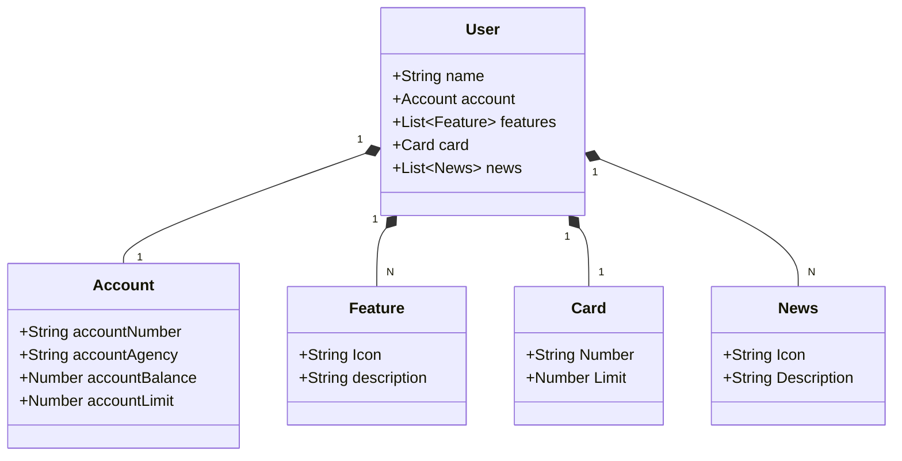

# Java RESTful API  - Digrama de Classes   
 

```mermaid

 classDiagram
    User "1" *-- "1" Account
    User "1" *-- "N" Feature
    User "1" *-- "1" Card
    User "1" *-- "N" News

    class User {
        +String name
        +Account account
        +List~Feature~ features
        +Card card
        +List~News~ news
    }

    class Account {
        +String accountNumber
        +String accountAgency
        +Number accountBalance
        +Number accountLimit
    }

    class Feature {
        +String Icon
        +String description
    }

    class Card {
        +String Number
        +Number Limit
    }

    class News {
        +String Icon
        +String Description
    }

```
